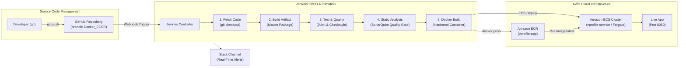

# VProfile Cloud-Native Container CI/CD (Docker, Amazon ECR & Amazon ECS)

[]()
[]()
[]()
[]()
[]()
[]()
[]()
[]()
[]()

> **Project Author:** Ankit Gawade  
> **Repository:** [https://github.com/gawadeAnkit/Jenkins](https://github.com/gawadeAnkit/Jenkins)  
> **Active Branch:** `Docker_ECSR`

A modern, cloud-native Continuous Integration & Continuous Deployment (CI/CD) pipeline on AWS. This architecture packages the Java 17 / Spring 6 VProfile application into Docker containers, enforces static code analysis and quality gates via SonarQube, publishes versioned container images to Amazon Elastic Container Registry (ECR), and executes zero-downtime rolling deployments on Amazon Elastic Container Service (ECS Fargate).

---

## Architecture Overview (`Docker_ECSR`)



---

## Enterprise Repository Structure

```
├── .dockerignore                 # Excludes build caches from Docker context
├── .gitignore                    # Enterprise Git ignore rules
├── Dockerfile                    # Production CIS-hardened Tomcat 10 / Java 17 container
├── Jenkinsfile                   # 7-stage DevSecOps declarative pipeline
├── pom.xml                       # Maven build descriptor (Java 17 / Spring 6)
├── README.md                     # Architecture documentation & runbooks
├── src/                          # Application source code & test suites
│   ├── main/java/com/vprofile/
│   ├── main/resources/
│   └── test/
├── terraform/                    # Infrastructure as Code (IaC)
│   ├── cloudwatch_monitoring.tf  # Free-tier dashboard & alarms
│   ├── ecr.tf                    # Amazon ECR container registry
│   ├── ecs.tf                    # Amazon ECS Fargate cluster & service
│   ├── main.tf                   # VPC, Subnet & Key pairs
│   ├── outputs.tf                # Exported endpoints & connection commands
│   ├── provider.tf               # AWS Provider configurations
│   ├── variables.tf              # Configurable variables
│   ├── terraform.tfvars.example  # Example variable definitions
│   └── scripts/                  # Automated EC2 server bootstrap scripts
└── scripts/                      # Operational Automation Scripts
    ├── start-lab.ps1             # Starts stopped instances & displays live endpoints
    ├── stop-lab.ps1              # Stops all instances ($0.00 compute charges)
    └── destroy-lab.ps1           # Full teardown script
```

---

## Pipeline Stages Breakdown

| Stage | Tooling | Description |
| :--- | :--- | :--- |
| **1. Initialize & Fetch** | Git / GitHub | Checks out branch `Docker_ECSR` and dispatches start alert to Slack. |
| **2. Build Artifact** | Maven 3.9 | Compiles Java 17 source code and packages `target/vprofile-v2.war`. |
| **3. Quality Assurance** | JUnit & Checkstyle | Runs unit tests and verifies code styling standards in parallel. |
| **4. Static Analysis** | SonarQube Scanner | Audits code complexity, security vulnerabilities, and enforces Quality Gate. |
| **5. Docker Build** | Docker / Tomcat 10 | Builds hardened, non-root container image tagged with `${BUILD_NUMBER}-${SHA}` and `latest`. |
| **6. Publish to ECR** | AWS CLI / Docker | Authenticates with AWS ECR and pushes release container images. |
| **7. ECS Deploy** | AWS ECS / Fargate | Triggers a zero-downtime rolling deployment (`aws ecs update-service --force-new-deployment`). |

---

## Local Verification Runbook

### 1. Build and Run Container Locally
```bash
# Compile and build container image
mvn clean package -DskipTests
docker build -t vprofile-app:local .

# Run container on port 8080
docker run -d -p 8080:8080 --name vprofile vprofile-app:local

# Verify in browser
curl -I http://localhost:8080/
```

### 2. Deploy Cloud Infrastructure via Terraform
```bash
cd terraform
terraform init
terraform plan
terraform apply
```

### 3. Automated CI/CD Trigger
Push any change to the `Docker_ECSR` branch:
```bash
git add .
git commit -m "feat: trigger container CI/CD deployment"
git push origin Docker_ECSR
```
GitHub Webhook triggers Jenkins automatically, builds the Docker container, pushes to Amazon ECR, and deploys to Amazon ECS.