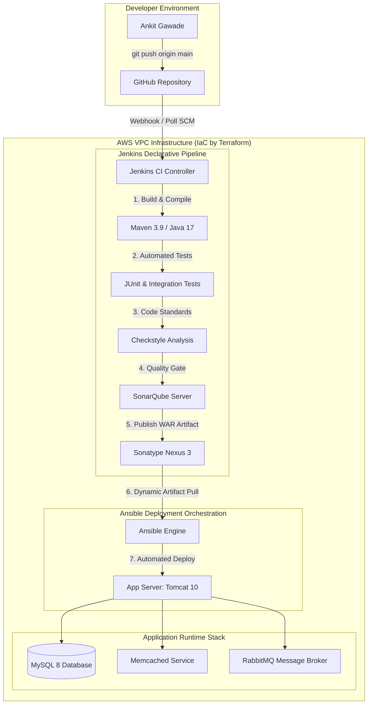

# VProfile Enterprise CI/CD & Automated Infrastructure Pipeline

[]()
[]()
[]()
[]()
[]()
[]()
[]()
[]()
[]()

> **Project Author:** Ankit Gawade  
> **Repository:** [https://github.com/gawadeAnkit/Jenkins](https://github.com/gawadeAnkit/Jenkins)

An enterprise-grade, end-to-end Continuous Integration and Continuous Deployment (CI/CD) pipeline built on AWS. This project provisions multi-server cloud infrastructure via Terraform, compiles and tests a Spring 6 / Java 17 multi-tier web application via Jenkins, enforces static code quality gates via SonarQube, manages release artifacts in Sonatype Nexus 3, and orchestrates zero-downtime application deployments to Apache Tomcat 10 via Ansible.

---

## Architecture Overview



---

## Infrastructure Topology (Terraform)

All infrastructure is provisioned as code in `v_project/terraform/`:

| Server Role | Operating System | Specs | Open Ports | Purpose |
| :--- | :--- | :--- | :--- | :--- |
| **Jenkins Controller** | Ubuntu 22.04 LTS | `t3.micro` | `22`, `8080` | CI/CD automation & pipeline orchestration |
| **SonarQube Server** | Ubuntu 22.04 LTS | `t3.micro` | `22`, `9000` | Code smell, security, & Quality Gate analysis |
| **Nexus 3 Server** | Ubuntu 22.04 LTS | `t3.micro` | `22`, `8081` | Binary artifact repository manager |
| **Tomcat App Server** | Ubuntu 22.04 LTS | `t3.micro` | `22`, `8080` | Production runtime host (Tomcat 10, MySQL, RabbitMQ) |

---

## Pipeline Workflow

The Jenkins pipeline (`v_project/Jenkinsfile`) executes the following automated stages:

1. **SCM Checkout:** Pulls the latest commits from the `main` branch.
2. **Build:** Packages the Java 17 web application into a deployable Web Archive (`WAR`).
3. **Unit & Integration Testing:** Executes test suites and generates code coverage reports with JaCoCo.
4. **Code Quality Analysis:** Evaluates project code standards using Maven Checkstyle.
5. **SonarQube Quality Gate:** Sends source code metrics to SonarQube Scanner and halts the pipeline if quality criteria are unmet.
6. **Publish to Nexus:** Generates dynamic build versions (`${BUILD_ID}-${TIMESTAMP}`) and uploads both the `.war` and `pom.xml` to Nexus repository `vprofile-release`.
7. **Real-Time Slack Notifications:** Dispatches rich notification cards (Pipeline Started, Succeeded, Failed) to Slack with build numbers, commit hashes, SonarQube Quality Gate status, and direct Jenkins console links.
8. **Workspace Cleanup:** Executes `cleanWs()` in post-build actions to maintain disk hygiene across build nodes.

---

## Deployment Automation (Ansible)

Configuration management and application deployment are automated via Ansible playbooks in `v_project/ansible/`:

* **`tomcat_setup.yml`:** Provisions OpenJDK 17, downloads Apache Tomcat 10.1.28, sets up dedicated `tomcat` service accounts, configures systemd unit services, and ensures boot persistence.
* **`vpro-app-setup.yml`:** Dynamically queries the Nexus REST API for the latest release artifact, performs zero-downtime backup of existing deployments, deploys `ROOT.war`, and verifies successful startup.

---

## Project Structure

```text
├── README.md                      # Root project documentation
├── v_project/
│   ├── Jenkinsfile                # Jenkins Declarative Pipeline definition (with Slack alerts)
│   ├── pom.xml                    # Maven project configuration (Java 17, Spring 6)
│   ├── ansible/                   # Ansible configuration management
│   │   ├── inventory              # Target host definitions
│   │   ├── tomcat_setup.yml       # Tomcat 10 & Java 17 provisioning playbook
│   │   ├── vpro-app-setup.yml     # Artifact deployment playbook
│   │   └── templates/             # Systemd service templates
│   ├── terraform/                 # Infrastructure as Code (AWS)
│   │   ├── main.tf                # VPC, subnets, keys, & Jenkins definition
│   │   ├── sonarqube.tf           # SonarQube infrastructure
│   │   ├── nexus.tf               # Nexus 3 infrastructure
│   │   ├── app_server.tf          # Tomcat application host infrastructure
│   │   ├── cloudwatch_monitoring.tf # CloudWatch monitoring dashboard & alarms
│   │   ├── variables.tf           # Configuration variables
│   │   └── scripts/               # Server initialization bootstrap scripts
│   ├── scripts/                   # Local lab management scripts
│   │   ├── start-lab.ps1          # Powershell script to boot all lab instances
│   │   ├── stop-lab.ps1           # Powershell script to stop compute hours
│   │   └── destroy-lab.ps1        # Interactive complete teardown script
│   └── src/                       # Java application source code
│       ├── main/java/com/vprofile/account/  # Controllers, Services, & Models
│       ├── main/resources/                  # Database scripts & app properties
│       ├── main/webapp/                     # JSP views & Spring configurations
│       └── test/java/com/vprofile/account/  # Automated unit & integration tests
```

---

## Getting Started

### 1. Provision Infrastructure
```bash
cd v_project/terraform
terraform init
terraform apply -auto-approve
```

### 2. Configure CI Pipeline
* Access Jenkins at `http://<JENKINS_IP>:8080`.
* Create a new Pipeline job pointing to `https://github.com/gawadeAnkit/Jenkins.git` with script path `v_project/Jenkinsfile`.
* Add credentials for GitHub, SonarQube, and Nexus.

### 3. Deploy Application
Run the Ansible deployment playbooks:
```bash
cd v_project/ansible
ansible-playbook -i inventory tomcat_setup.yml
ansible-playbook -i inventory vpro-app-setup.yml
```

### 4. Access the Live Application
* **Web UI:** `http://<APP_SERVER_IP>:8080/`
* **Default Admin Account:** `admin_vp` / `admin_vp`

---

## Lab Lifecycle Management

To manage cloud resources effectively:
* **Stop instances:** `.\v_project\scripts\stop-lab.ps1`
* **Resume instances:** `.\v_project\scripts\start-lab.ps1`
* **Tear down completely:** `.\v_project\scripts\destroy-lab.ps1`