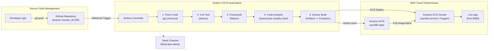

# VProfile Cloud-Native Container CI/CD (Docker, Amazon ECR & Amazon ECS)

[]()
[]()
[]()
[]()
[]()
[]()
[]()
[]()
[]()

> **Project Author:** Ankit Gawade  
> **Repository:** [https://github.com/gawadeAnkit/Jenkins](https://github.com/gawadeAnkit/Jenkins)  
> **Active Branch:** `Docker_ECSR`

A modern, cloud-native Continuous Integration & Continuous Deployment (CI/CD) pipeline on AWS. This architecture packages the Java 17 / Spring 6 VProfile application into Docker containers, enforces static code analysis and quality gates via SonarQube, publishes versioned container images to Amazon Elastic Container Registry (ECR), and executes zero-downtime rolling deployments on Amazon Elastic Container Service (ECS Fargate).

---

## Architecture Overview (`Docker_ECSR`)



---

## Pipeline Stages Breakdown

| Stage | Tooling | Description |
| :--- | :--- | :--- |
| **1. Fetch Code** | Git / GitHub | Checks out the target branch (`Docker_ECSR`) and dispatches pipeline start alert to Slack. |
| **2. Unit Test** | Maven 3.9 / JUnit 4 | Executes unit test suites and validates application business logic. |
| **3. Checkstyle** | Maven Checkstyle | Validates source code formatting, naming conventions, and syntax standards. |
| **4. Code Analysis** | SonarQube Scanner 4 | Audits code complexity, security vulnerabilities, code smells, and enforces Quality Gate. |
| **5. Docker Build** | Docker / Tomcat 10 | Packages the Maven WAR artifact (`vprofile-v2.war`) into a Tomcat 10 runtime container image. |
| **6. Push to ECR** | AWS CLI / Docker | Authenticates with AWS ECR and pushes tagged release images (`${BUILD_NUMBER}` and `latest`). |
| **7. ECS Deploy** | AWS ECS / Fargate | Triggers a zero-downtime rolling deployment (`aws ecs update-service --force-new-deployment`). |

---

## Infrastructure as Code (Terraform)

The cloud-native container infrastructure is defined in `v_project/terraform/`:

* **`ecr.tf`:** Provisions private repository `vprofile-app` with image scan on push and 14-day lifecycle expiration policy to preserve Free Tier limits.
* **`ecs.tf`:** Provisions serverless Amazon ECS Fargate cluster `vprofile-cluster`, CloudWatch logs `/ecs/vprofile-app`, IAM execution role, container task definition (0.25 vCPU, 512 MB RAM), and public-facing ECS service.
* **`cloudwatch_monitoring.tf`:** CloudWatch dashboard and alarm monitors for CPU, memory, and container health metrics.

---

## Deployment & Verification

### 1. Build and Run Container Locally
```bash
cd v_project
mvn clean package -DskipTests
docker build -t vprofile-app:local .
docker run -d -p 8080:8080 --name vprofile vprofile-app:local
# Visit http://localhost:8080/
```

### 2. Deploy Infrastructure via Terraform
```bash
cd v_project/terraform
terraform init
terraform plan
terraform apply
```

### 3. Automated Trigger
Push any change to the `Docker_ECSR` branch:
```bash
git add .
git commit -m "feat: trigger container CI/CD deployment"
git push origin Docker_ECSR
```
GitHub Webhook triggers Jenkins automatically, builds the Docker container, pushes to Amazon ECR, and deploys to Amazon ECS.